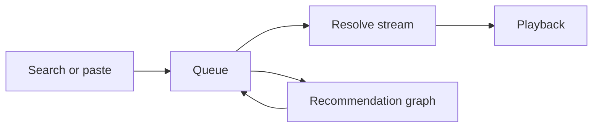

<div align="center">

# Ember

**A cozy floating music companion for Windows.**

*Slim as a ribbon · Warm as lamplight · Endlessly yours*

</div>

<div align="center">


</div>

---

Ember lives in the corner of your desktop. Most of the time it is a thin amber
ribbon — artwork, track name, transport controls. Open it and it unfolds into a
full player: search, queue, a volume dial, and a spinning record that keeps time
with whatever is playing.

Search for something once. Ember keeps pulling look-alike tracks in behind it, so
the music does not stop when the results run out.

---

## ✨ What it does

| | |
|:--|:--|
| 🔍 **Search or paste** | Free-text search across the public catalogue, or drop a link straight into the field |
| ♾️ **Endless queue** | The recommendation graph feeds new tracks in as you listen |
| 🪟 **Ribbon → panel** | A compact ribbon that expands into a full player when you want it |
| 🎛️ **Hand-painted controls** | Rotating vinyl, live equaliser bars, drag-to-set volume dial |
| 📌 **Always on top** | Stays above your windows without stealing focus |
| 🖥️ **Tray presence** | Play, skip and reveal from the system tray |
| ⌨️ **Hotkeys** | Everything you touch often, one chord away |
| 💾 **Remembers** | Position, volume and endless mode, restored on launch |

---

## 🚀 Install

**Windows · Python 3.10 or newer**

```bat
install.bat
```

Creates a local `.venv` and installs the dependencies into it. Your system Python
is never touched.

```bat
launch.bat
```

**Prefer to drive it yourself:**

```bat
python -m venv .venv
.venv\Scripts\python.exe -m pip install -r requirements.txt
.venv\Scripts\pythonw.exe -m ember
```

---

## ⌨️ Hotkeys

| Keys | Action |
|:--|:--|
| `Ctrl` + `Alt` + `Space` | Play / pause |
| `Ctrl` + `Alt` + `→` | Next track |
| `Ctrl` + `Alt` + `←` | Previous track |
| `Ctrl` + `Alt` + `↑` | Expand the panel |
| `Ctrl` + `Alt` + `↓` | Collapse the panel |
| `Ctrl` + `Alt` + `E` | Toggle expanded |
| `Ctrl` + `Alt` + `F` | Focus the search field |

---

## 🗂️ Layout

```
ember/
├── __init__.py     package marker
├── __main__.py     python -m ember
├── app.py          wiring, session restore, hotkeys, lifecycle
├── catalog.py      catalogue search and the recommendation graph
├── config.py       branding, palette, geometry, tunables
├── jobs.py         off-thread work as QRunnables
├── models.py       the Song dataclass
├── panel.py        the floating surface
├── player.py       queue, media player, thread pool
├── stream.py       audio stream resolution
├── theme.py        stylesheets built from the palette
├── tray.py         tray icon, menu, single-instance guard
└── utils.py        small helpers
```

---

## 🎨 Design

One palette. One source of truth.

> Espresso base, amber light, cream type — built for a dark room and a long
> evening.

Every colour lives in a single `Palette` class in `config.py`. `theme.py` renders
those tokens into Qt stylesheets with `string.Template`, and every custom-painted
widget in `panel.py` — the vinyl, the equaliser, the dial — reads from the same
place. Change `Palette` and the whole application re-skins.

---

## ⚙️ How it works

Search and recommendations run against the public catalogue. Audio is resolved on
a thread pool, so the interface never blocks.

Stream resolution and queue building are **separate jobs**. Playback starts the
moment the audio URL is ready — it never waits on the recommendation call.



---

## 📄 Notes

- No account required — search and recommendations use the guest surface.
- Nothing is written to disk except your settings and a log file.
- Built with PyQt6, `ytmusicapi` and `yt-dlp`.

---

<div align="center">
<sub><strong>Ember</strong> — cozy listening.</sub>
</div>