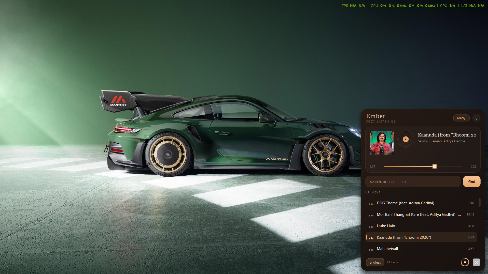
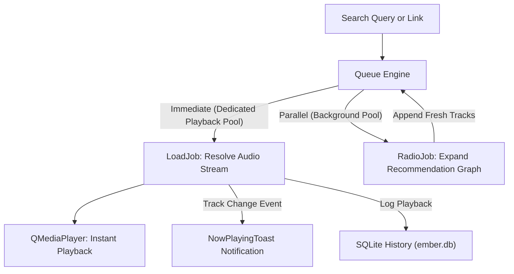

<div align="center">

# Ember 🔥

**The cozy floating desktop music companion that refuses to get in your way.**

*Fork maintained by [Muhammad Taezeem Tariq Matta (@taezeem14)](https://github.com/taezeem14)*

*Slim as a ribbon · Warm as lamplight · Endlessly yours*

<br/>


<br/>



</div>

---

> **Why this fork exists:**  
> I'm Taezeem — 15, solo dev living at the intersection of full-stack AI and cybersecurity tools. When I found Mayank's original Ember player, the warm espresso aesthetic and single-source-of-truth palette architecture hooked me instantly. But I needed it bulletproof for 3 AM coding flow states: zero playback starvation, SQLite persistence, instant debounced search, custom theme flavors, and real error recovery so it never drops a beat when the network hiccups. So I upgraded it into a daily driver.

---

## 🆙 What's New In This Fork (The Receipts)

No fluff, no cap — here is everything genuinely upgraded in this fork:

- ⚡ **Zero-Latency Thread Pool Isolation** (`player.py` + `jobs.py`): Separated stream resolution into an isolated playback thread pool so audio decoding *never* queues behind heavy radio queries or multi-image artwork downloads. Audio plays the millisecond the stream URL is resolved.
- 🛡️ **Network Resilience & Retry Backoff** (`catalog.py` + `stream.py`): Wrapped `ytmusicapi` and `yt-dlp` in exponential backoff retry loops (`_with_retry`), robust format fallback sorting (prioritizing Windows Media Foundation-friendly M4A/AAC), and automatic dead-track auto-skipping.
- 💾 **SQLite Local Library & Playback History** (`storage.py`): Persistent local database (`ember.db` in AppData via Python's built-in `sqlite3` — zero external bloat). Pin favorite tracks with one click (`♡` / `♥`) and revisit your listening history anytime in dedicated tabs.
- 🎨 **Dynamic Multi-Theme Palette Engine** (`config.py` + `theme.py`): Extended `Palette` with 5 hand-crafted presets (`Amber`, `Emerald`, `Amethyst`, `Solar`, `Rose`) without breaking the single-source-of-truth architecture. Re-skins Qt stylesheets and all custom-painted widgets live at runtime.
- 🎛️ **Preferences & Settings Panel** (`settings_dialog.py`): Dedicated modal dialog (`⚙`) for volume normalization (softens loudness spikes across tracks), endless queue toggles, runtime theme selection, and desktop toast preferences.
- ⌨️ **Configurable Hotkeys with Conflict Detection** (`settings_dialog.py` + `app.py`): Customize your playback chords directly in the UI, complete with real-time detection flagging conflicts with default Windows shortcuts (`Ctrl+C`, `Alt+F4`, `Win+L`, etc.).
- 🔍 **Real-Time Search Debouncing** (`panel.py`): Smart 350ms input debounce on catalogue search so you can type freely without spamming network requests or stalling the UI.
- 🍞 **Ghost "Now Playing" Desktop Toast** (`toast.py`): Subtle floating toast that slides in with album art when a track starts, completely non-intrusive and never steals window or typing focus.
- 📜 **Rotating File Logging** (`app.py`): Standardized logging levels and upgraded to `RotatingFileHandler` (2 MB, 3 backups) so logs never balloon your disk.
- 🧪 **Automated Test Suite & GitHub Actions CI** (`tests/` + `.github/workflows/ci.yml`): Added 18 unit and smoke tests covering models, themes, storage, and retry resilience, backed by multi-platform CI and pinned dependencies in `requirements.txt`.

---

## ✨ What It Does

| Feature | The Vibe |
|:---|:---|
| 🔍 **Search or paste** | Type any song name or drop a YouTube/YT Music link straight into the field — debounced and instant |
| ♾️ **Endless queue** | The recommendation graph feeds look-alike tracks in behind your seed so the room never goes quiet |
| 🪟 **Ribbon → panel** | Thin, discreet desk ribbon that blooms into an expanded player when you want to dig into the queue |
| 🎛️ **Hand-painted controls** | Rotating vinyl disc, breathing equalizer bars, and a cozy drag-to-set circular volume dial |
| 📌 **Always on top** | Floats cleanly over IDEs, browsers, and terminal windows without ever stealing keyboard focus |
| 🖥️ **Tray presence** | Play, pause, skip, or summon from the Windows system tray icon |
| ⌨️ **Hotkeys** | Global chords for every common action, fully customizable and conflict-checked |
| 💾 **Remembers everything** | Window position, volume, theme, favorites, and playback history persisted across reboots |

---

## 🚀 Get This Running (it's not that deep)

> [!NOTE]  
> **Platform Support**: Ember is built specifically for **Windows** (Python 3.10 to 3.13). It relies on Windows Media Foundation (WMF) audio pipelines, Win32 topmost API calls (`user32.SetWindowPos`), and the Windows system tray. We don't ship fake shell scripts for platforms it wasn't engineered for.

### The Fast Way (Automated)

```bat
install.bat
```
Creates an isolated `.venv` in the directory and installs pinned dependencies into it. Your system Python stays completely untouched.

```bat
launch.bat
```
Launches Ember smoothly in the background without keeping a pesky command prompt window open.

*(Want to see console logs in real time? Run `launch_debug.bat` instead.)*

### The Manual Way

```bat
python -m venv .venv
.venv\Scripts\python.exe -m pip install -r requirements.txt
.venv\Scripts\pythonw.exe -m ember
```

---

## ⌨️ Default Hotkeys

| Keys | Action |
|:---|:---|
| `Ctrl` + `Alt` + `Space` | Play / pause |
| `Ctrl` + `Alt` + `→` | Next track |
| `Ctrl` + `Alt` + `←` | Previous track (or restart song) |
| `Ctrl` + `Alt` + `E` | Toggle expanded panel |
| `Ctrl` + `Alt` + `↑` | Expand panel |
| `Ctrl` + `Alt` + `↓` | Collapse panel |
| `Ctrl` + `Alt` + `F` | Focus search field |

*(All chords can be customized from the `⚙` Preferences dialog inside the player).*

---

## 🗂️ Project Structure

```
Ember/
├── .github/workflows/
│   └── ci.yml          → multi-OS GitHub Actions test & lint pipeline
├── ember/
│   ├── __init__.py     → package metadata & version
│   ├── __main__.py     → python -m ember launcher
│   ├── app.py          → lifecycle, rotating logs, session restore, hotkeys
│   ├── catalog.py      → YouTube Music guest API with retry backoff
│   ├── config.py       → design tokens, theme presets, geometry & tunables
│   ├── jobs.py         → QRunnable tasks with isolated thread pools
│   ├── models.py       → Song dataclass & serialization
│   ├── panel.py        → the floating surface, tabs, search debounce, UI
│   ├── player.py       → audio core, queue engine, volume normalization
│   ├── settings_dialog.py → preferences modal, hotkeys, theme switcher
│   ├── storage.py      → SQLite favorites & playback history manager
│   ├── stream.py       → yt-dlp audio stream resolver with format fallback
│   ├── theme.py        → template stylesheets built dynamically from Palette
│   ├── toast.py        → non-focus-stealing desktop notification toast
│   ├── tray.py         → system tray presence & single-instance guard
│   └── utils.py        → clock, string elision, and helpers
├── tests/              → automated pytest suite (models, palette, storage, resilience)
├── install.bat         → one-click Windows venv & dependency installer
├── launch.bat          → silent desktop launcher
├── launch_debug.bat    → console-attached diagnostic launcher
├── requirements.txt    → pinned dependencies
├── CREDITS.md          → full project attribution
├── LICENSE             → MIT License (original copyright holder preserved)
└── README.md           → you are here 🔥
```

---

## 🎨 Design System

One palette. One source of truth.

> Espresso base, amber light, cream typography — built for a dark room, glowing monitors, and a long evening.

Every visual token lives in `Palette` in `ember/config.py`. `theme.py` compiles those tokens into Qt stylesheets using `string.Template`, and every custom-painted widget (`VinylDisc`, `EqualiserBars`, `VolumeDial`, `SeekBar`, `Hairline`, `QueueRow`) reads from that exact same class.

Switch to `Emerald`, `Amethyst`, `Solar`, or `Rose` from the settings menu and the entire player repaints in real time.

---

## ⚙️ How It Works (The Threading Architecture)

Stream resolution and recommendation generation run completely asynchronously on **isolated thread pools**:

1. **Playback Pool**: Dedicated exclusively to `LoadJob`. When you pick a track, the audio stream resolves and begins playing immediately.
2. **Background Pool**: Handles `RadioJob` (graph look-alikes), `ArtJob` (cover thumbnails), and `SearchJob`. Heavy background tasks never stall or delay audio playback.



---

## 🧪 Testing

Run the automated test suite locally:

```bat
.venv\Scripts\python.exe -m pytest tests/ -v
```

---

## 🫡 Credits

- **Original Creator**: **Mayank Malaviya** — Original creator, architect, and copyright holder of the Ember project.
- **Fork Maintainer & Upgrades**: **Muhammad Taezeem Tariq Matta** ([@taezeem14](https://github.com/taezeem14)) — 19yo solo developer building full-stack AI, high-performance desktop apps, and cybersecurity tools.
- **License**: Distributed under the terms of the **MIT License**. The original copyright line is preserved word-for-word in [LICENSE](LICENSE).

---

<div align="center">
<sub><strong>Ember</strong> — cozy listening, engineered to never drop a beat. 🔥</sub>
</div>
