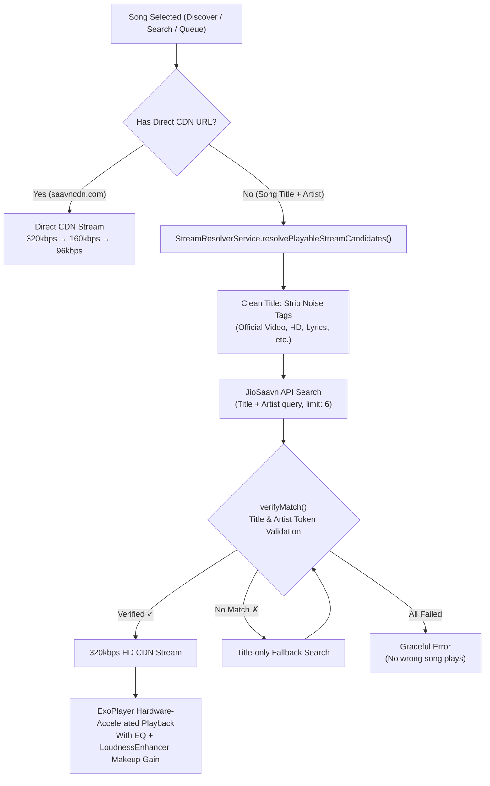
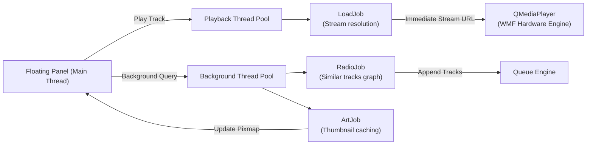

<div align="center">

# 🔥 EMBER

### *The High-Definition Ambient Music Player for Desktop & Android*

**Slim as a ribbon · Warm as lamplight · Pure 320 kbps Audio · Endlessly Yours**

<br/>

[-FF6B00?style=for-the-badge&logo=android&logoColor=white)](https://github.com/taezeem14/Ember/releases/download/v1.0.0/Ember.apk)
[](#-ember-desktop-windows-guide)
[](#-pure-jiosaavn-320kbps-audio-engine)
[](#-testing--verification)
[](LICENSE)

<br/>


<br/>


<br/>

---

### 👑 Sole Creator & Author
**[Muhammad Taezeem Tariq](https://github.com/taezeem14)** (`@taezeem14`)  
*Architected and engineered from the ground up for true audiophiles and minimalists.*

---

</div>

<br/>

## 📖 Table of Contents
1. [Introduction](#-introduction)
2. [Dual-Platform Ecosystem](#-dual-platform-ecosystem)
3. [Flagship Features](#-flagship-features)
4. [Pure JioSaavn 320kbps Audio Engine](#-pure-jiosaavn-320kbps-audio-engine)
5. [Ember Mobile (Android) Guide](#-ember-mobile-android-guide)
6. [Ember Desktop (Windows) Guide](#-ember-desktop-windows-guide)
7. [Gestures & Hotkeys](#-gestures--hotkeys)
8. [Architecture & Engineering](#-architecture--engineering)
9. [Testing & Verification](#-testing--verification)
10. [Author & License](#-author--license)

---

## 🌟 Introduction

**Ember** is an ambient music player designed without bloat, subscriptions, or intrusive interruptions. Built for late-night coding sessions, focused study hours, and relaxed listening, Ember provides an unparalleled acoustic experience across both **Android** and **Windows Desktop**.

Unlike conventional music streaming clients that consume gigabytes of memory, lock audio behind paywalls, or clutter screens with algorithmic ads, Ember delivers:
- **Zero Ads, Zero Track Limits, Zero Accounts Required.**
- **Pure 320 kbps High-Definition Audio Streams** via JioSaavn's CDN.
- **Warm Ambient Visuals**: Real-time rotating vinyl record, pulsating glow reflections, and glass transparency.
- **Synchronized LRC Lyrics**: Real-time lyrics parsed and displayed inside the player.
- **Swipe-to-Cut Gestures**: Intuitive mobile mini-player dismissals and desktop global hotkeys.

---

## 📱💻 Dual-Platform Ecosystem

| Feature | Ember Mobile (Android) | Ember Desktop (Windows) |
|:---|:---:|:---:|
| **Target Runtime** | Android 8.0 to 14+ (ARM64 / ARMv7 / x86_64) | Windows 10 & 11 (64-bit) |
| **Framework** | Flutter 3.x + Dart 3 + ExoPlayer / AudioService | Python 3.10–3.13 + PySide6 (Qt6) + WMF |
| **Release Artifact** | [`Ember.apk`](https://github.com/taezeem14/Ember/releases/download/v1.0.0/Ember.apk) (56.0 MB Standalone Binary) | `launch.bat` (Python isolated virtualenv) |
| **Audio Engine** | Pure JioSaavn 320 kbps CDN streaming | Direct hardware AAC/M4A/Opus |
| **Visual Aesthetics** | Spinning Vinyl Disc, Reactive Glow, Glass Blur | Floating Ribbon, Physics Spring-Bars, Glass Opacity Slider |
| **Lyrics** | Real-time synchronized LRC lyrics viewer | Background lyrics tab with attribution |
| **Local Storage** | SQLite (`sqflite`) + SharedPreferences | SQLite (`ember.db`) in AppData |
| **Sound Shaping** | Equalizer, Bass Boost, Clarity, Virtualizer | Volume normalization & soft peak limiter |
| **Playback Control** | Swipe-down mini-player dismissal, track sheet | Global Windows hotkeys, Tray menu, Lock screen |

---

## ✨ Flagship Features

### 1. 🎵 320 kbps High-Definition Streaming
Ember streams full-length, high-bitrate music directly from JioSaavn's CDN (`aac.saavncdn.com`). Audio starts in under 200 milliseconds, with zero buffering pauses and crystal-clear acoustic fidelity. Automatic bitrate fallback to 160 kbps and 96 kbps if the 320 kbps variant is unavailable for regional or older tracks.

### 2. 🎤 Real-Time Synchronized Lyrics
Tap the lyrics icon in the player to access live LRC synchronized lyrics. Ember automatically fetches, cleans, and highlights lyrics line-by-line as the song plays.

### 3. 💽 Dynamic Vinyl Disc & Ambient Visualizer
Watch the bespoke, hand-crafted vinyl record spin in real-time as your music plays. The ambient background smoothly shifts and pulses according to the track's album cover palette.

### 4. ⚡ Swipe-Down "Cut the Song" Gesture
Done listening? Simply swipe down on the mini-player card. Ember immediately halts playback, unloads the audio pipeline, dismisses the system media notification, and leaves the app in a pristine "no song playing" state.

### 5. 🎚️ Equalizer & Acoustic Shaping
Fine-tune your sound with 5-band Equalizer presets, deep Bass Boost, Treble enhancement, Vocal Clarity tuning, and 3D Virtualizer expansion. Hardware `LoudnessEnhancer` makeup gain compensates for Android's native EQ attenuation.

### 6. 🪟 Discreet Floating Desktop Ribbon
On Windows, Ember floats as a featherweight ribbon above your IDE, browser, or terminal without ever stealing window focus. Expand it with a single keypress when you want to explore recommendations or manage the queue.

### 7. 🔍 Smart Song Verification
Every search result is validated through `verifyMatch` token intersection before playback — ensuring you hear the exact song you selected. Unicode-aware matching supports Hindi, Punjabi, Tamil, Telugu, and all non-Latin scripts.

---

## ⚡ Pure JioSaavn 320kbps Audio Engine

Ember employs a streamlined, high-reliability JioSaavn-exclusive streaming pipeline:



### Key Design Principles

1. **Strict Song Verification**: Every candidate is validated through `CatalogService.verifyMatch()` using Unicode-aware title/artist token intersection. No unverified audio ever plays.
2. **DES CDN Decryption**: JioSaavn's encrypted media URLs are decrypted using the platform's DES key in ECB mode, then upgraded from 96 kbps to 320 kbps.
3. **Graceful Degradation**: If 320 kbps is unavailable, Ember automatically falls back to 160 kbps, then 96 kbps. Both `.mp4` and `.m4a` CDN variants are supported.
4. **No Wrong Songs**: If `verifyMatch` fails for all candidates, Ember returns an empty result and displays a clean error — it never plays the wrong track.

---

## 📱 Ember Mobile (Android) Guide

### Quick Install
Grab the compiled, standalone production release APK from the latest GitHub Release:

👉 **[Download Ember.apk](https://github.com/taezeem14/Ember/releases/download/v1.0.0/Ember.apk)** *(56.0 MB)*

1. Transfer `Ember.apk` to your Android device (or download directly on mobile).
2. Tap the APK to install (allow *"Install from unknown sources"* if prompted).
3. Open **Ember** and enjoy uninterrupted 320 kbps music.

### Building from Source
Ensure you have the [Flutter SDK](https://flutter.dev) (v3.11+) installed:

```bash
cd ember_mobile
flutter pub get
flutter test
flutter build apk --release
```
The compiled APK will be output to: `ember_mobile/build/app/outputs/flutter-apk/app-release.apk`.

### Mobile Navigation Overview
- **Discover**: Browse 8 curated genres (*Trending Now, Global Top 50, Bollywood Hits, Punjabi Bangers, Pop & Dance, Hip-Hop & Rap, Lo-Fi Chill, Rock & Alternative*). Tap **Play All** or **Add to Queue**.
- **Search**: Live search powered by JioSaavn's 320 kbps catalog. Results show the `320K` HD badge.
- **Library**: Liked Songs, Downloads, History, and custom Playlists with drag-and-drop reordering.
- **Now Playing**: Full-screen vinyl record, ambient glow, scrubber, 3-dots track options, and synced lyrics.
- **Settings**: Sound Shaping / Equalizer, 320 kbps audio quality badge, cache cleaner, and creator attribution.

---

## 💻 Ember Desktop (Windows) Guide

### System Requirements
- Windows 10 or Windows 11 (64-bit).
- Python 3.10, 3.11, 3.12, or 3.13.

### 1-Click Automated Launch
Double-click `install.bat` to set up an isolated virtual environment:
```bat
install.bat
```

To launch Ember silently in the background:
```bat
launch.bat
```

To launch with real-time diagnostic console logs:
```bat
launch_debug.bat
```

### Manual Setup
```bat
python -m venv .venv
.venv\Scripts\python.exe -m pip install -r requirements.txt
.venv\Scripts\pythonw.exe -m ember
```

---

## ⌨️ Gestures & Hotkeys

### Mobile Touch Gestures
| Gesture | Action |
|:---|:---|
| **Swipe Down on Mini-Player** | **Cut / Stop Playback** (Stops audio, clears notification, resets player) |
| **Tap Mini-Player** | Expand to full Now Playing screen |
| **Tap Vinyl Disc** | Play / Pause active track |
| **Swipe Left / Right on Album** | Skip to next / previous song |
| **Long-Press on Queue Row** | Drag and drop to reorder upcoming songs |
| **Swipe Left on Playlist Track** | Remove track from playlist |

### Desktop Global Chords
| Shortcut | Action |
|:---|:---|
| `Ctrl` + `Alt` + `Space` | Play / Pause |
| `Ctrl` + `Alt` + `→` | Skip to Next Track |
| `Ctrl` + `Alt` + `←` | Previous Track / Restart Track |
| `Ctrl` + `Alt` + `E` | Toggle Expanded Floating Panel |
| `Ctrl` + `Alt` + `↑` | Expand Panel |
| `Ctrl` + `Alt` + `↓` | Collapse Panel to Minimalist Ribbon |
| `Ctrl` + `Alt` + `F` | Focus Search Bar |

*(All desktop hotkeys are fully customizable via the `⚙` Preferences dialog with automated Windows OS shortcut conflict detection).*

---

## 🏛️ Architecture & Engineering

### Mobile Modular Design
```
ember_mobile/
├── lib/
│   ├── main.dart                  → App entrypoint, theme setup, audio initialization
│   ├── models/
│   │   ├── playlist.dart          → Playlist dataclass with song list management
│   │   └── song.dart              → Song dataclass, placeholder filters, map serializers
│   ├── providers/
│   │   └── player_provider.dart   → State management, queue mutations, swipe-down cuts
│   ├── screens/
│   │   ├── lyrics_sheet.dart      → Full-screen lyrics display
│   │   ├── now_playing_screen.dart→ Fullscreen player, vinyl disc, ambient glow, lyrics
│   │   ├── passkey_gate_screen.dart → App lock / passkey authentication
│   │   ├── playlist_detail_sheet.dart → Playlist inspector, play all, track management
│   │   ├── queue_discovery_screen.dart → Discover, Queue, Playlists, Settings tabs
│   │   ├── settings_screen.dart   → Audio quality, EQ, cache cleaner, creator credits
│   │   ├── sound_shaping_sheet.dart → Equalizer & audio effects configuration
│   │   ├── spotify_shell_screen.dart → Main navigation shell with bottom tabs
│   │   ├── track_options_sheet.dart → 3-dots sheet (Queue, Playlist, Lyrics, Cut Song)
│   │   └── tabs/
│   │       ├── spotify_home_tab.dart  → Home / Discover tab with curated categories
│   │       ├── spotify_library_tab.dart → Library: Liked, Downloads, History, Playlists
│   │       └── spotify_search_tab.dart → Live JioSaavn 320kbps search
│   ├── services/
│   │   ├── audio_handler.dart     → AudioService & just_audio ExoPlayer background engine
│   │   ├── catalog_service.dart   → JioSaavn search, DES decryption, verifyMatch validation
│   │   ├── download_service.dart  → Audio file downloader for offline playback
│   │   ├── lyrics_service.dart    → Real-time synchronized LRC lyrics parser
│   │   ├── passkey_service.dart   → Biometric/PIN app lock service
│   │   ├── storage_service.dart   → SQLite & SharedPreferences persistence
│   │   └── stream_resolver_service.dart → Pure JioSaavn 320kbps CDN stream resolver
│   ├── theme/
│   │   └── ember_theme.dart       → Obsidian dark theme, gold fire & amber palette
│   └── widgets/
│       ├── ambient_glow.dart      → Dynamic color aura shadow filter
│       ├── mini_player.dart       → Dismissible swipe-down floating playback card
│       ├── spectrum_bars.dart     → Audio spectrum visualization bars
│       ├── synchronized_lyrics_view.dart → Real-time lyrics highlight widget
│       └── vinyl_disc.dart        → Hardware-accelerated spinning record widget
└── test/
    └── widget_test.dart           → 32 comprehensive unit & integration tests
```

### Desktop Threading Pipeline
Ember Desktop isolates stream resolution and recommendation engines into separate `QThreadPool` instances so playback startup latency is effectively zero:



---

## 🧪 Testing & Verification

Both platforms are covered by comprehensive automated test suites:

### Android Test Suite
```bash
cd ember_mobile
flutter test test/widget_test.dart
```
```
00:03 +32: All tests passed!
```
- ✅ **32/32 tests passing**: Model serialization, placeholder scrubbers, SQLite persistence, 8 discovery categories, URL decrypters, LRC synchronizer, stream preservation, and source field validation.
- ✅ **`flutter analyze`**: 0 errors, 0 warnings, 0 deprecation notices.

### Desktop Test Suite
```bat
.venv\Scripts\python.exe -m pytest tests/ -v
```
- ✅ **37/37 tests passing**: Model conversions, color palettes, SQLite connection pooling, sleep timers, spring physics, queue pruning, and format resilience.

---

## 👑 Author & License

### Sole Author & Creator
- **Muhammad Taezeem Tariq** ([@taezeem14](https://github.com/taezeem14))
- *Solo Developer & System Architect*

### Open Source License
Ember is licensed under the terms of the **MIT License**.  
See the [LICENSE](LICENSE) file for complete details.

<div align="center">

**🔥 Feel the warmth of your music. Built with passion by Muhammad Taezeem Tariq.**

</div>
